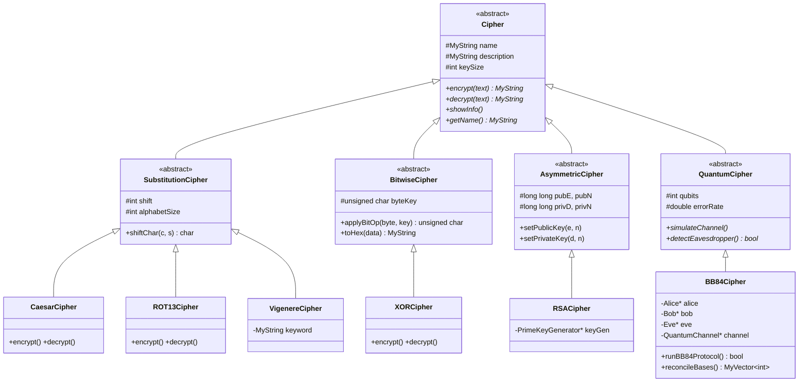

<p align="center">
  
  
  
  
  
</p>

<h1 align="center">🔐 QCrypt Messenger</h1>

<p align="center">
  <strong>A Quantum-Secured Encrypted Messaging Application</strong><br/>
  <em>Built from scratch with pure C++ and Object-Oriented Design Principles</em>
</p>

<p align="center">
  <a href="#-features">Features</a> •
  <a href="#-architecture">Architecture</a> •
  <a href="#-class-hierarchy">Class Hierarchy</a> •
  <a href="#-oop-concepts">OOP Concepts</a> •
  <a href="#-getting-started">Getting Started</a> •
  <a href="#-encryption-algorithms">Algorithms</a> •
  <a href="#-bb84-quantum-protocol">BB84 Protocol</a>
</p>

---

## 📖 Overview

**QCrypt Messenger** is a fully-featured encrypted messaging desktop application that simulates real-world cryptographic protocols — including the revolutionary **BB84 Quantum Key Distribution** protocol. Built entirely in **C++** with a custom GUI powered by **Raylib**, this project demonstrates advanced Object-Oriented Programming principles through a clean, extensible architecture spanning **30+ classes** organized into six distinct subsystems.

> **🎓 Academic Project** — Developed as a semester project for Object-Oriented Programming (OOP), demonstrating mastery of inheritance hierarchies, polymorphism, abstract classes, encapsulation, operator overloading, templates, and design patterns.

---

## ✨ Features

<table>
<tr>
<td width="50%">

### 🖥️ Graphical User Interface
- WhatsApp-inspired modern chat interface
- Contact sidebar with message count badges
- Real-time message encryption & decryption display
- Cipher selection dropdown
- Scrollable chat history with custom scrollbar
- Blinking cursor animation
- Hover effects on interactive elements

</td>
<td width="50%">

### 🔒 Cryptographic Engine
- **6 encryption algorithms** available in real-time
- Caesar Cipher (shift-based)
- ROT13 Cipher (fixed rotation)
- Vigenère Cipher (polyalphabetic)
- XOR Cipher (bitwise operations)
- RSA Cipher (asymmetric, prime-based)
- BB84 Quantum Cipher (quantum key distribution)

</td>
</tr>
<tr>
<td>

### ⚛️ Quantum Simulation
- Full **BB84 Protocol** implementation
- Alice (sender) & Bob (receiver) parties
- Eve (eavesdropper) with toggle activation
- Quantum channel simulation (Ideal, Noisy, Eavesdropped)
- Basis reconciliation (Rectilinear ⊕ Diagonal)
- Eavesdropper detection via error rate analysis

</td>
<td>

### 💾 Data Persistence
- File-based chat storage (pipe-delimited format)
- Automatic chat loading on startup
- Per-contact chat history files
- Message metadata with cipher information
- RSA key pair stats & BB84 protocol stats logged

</td>
</tr>
</table>

---

## 🏗️ Architecture

The project follows a **layered architecture** with clear separation of concerns:

```
┌─────────────────────────────────────────────────────────────────┐
│                      PRESENTATION LAYER                         │
│                MessengerGUI  ·  MessengerApp                    │
├─────────────────────────────────────────────────────────────────┤
│                      APPLICATION LAYER                          │
│              CryptoManager  ·  Contact  ·  Message              │
├───────────────────────┬─────────────────────────────────────────┤
│   CLASSICAL CRYPTO    │         QUANTUM CRYPTO                  │
│  CaesarCipher         │  BB84Cipher                             │
│  ROT13Cipher          │  Alice · Bob · Eve                      │
│  VigenereCipher       │  IdealChannel · NoisyChannel            │
│  XORCipher            │  EavesdroppedChannel                    │
│  RSACipher            │  RectilinearBasis · DiagonalBasis       │
├───────────────────────┴─────────────────────────────────────────┤
│                      MATHEMATICS LAYER                          │
│     ModularArithmetic · PrimeKeyGenerator · RandomGen           │
├─────────────────────────────────────────────────────────────────┤
│                      FOUNDATION LAYER                           │
│              MyString (custom) · MyVector<T> (template)         │
└─────────────────────────────────────────────────────────────────┘
```

---

## 🌳 Class Hierarchy

### Complete Inheritance Tree

```
Cipher (Abstract Base)
├── SubstitutionCipher (Abstract)
│   ├── CaesarCipher
│   ├── ROT13Cipher
│   └── PolyalphabeticCipher (Abstract)
│       └── VigenereCipher
├── BitwiseCipher (Abstract)
│   └── XORCipher
├── AsymmetricCipher (Abstract)
│   └── RSACipher
└── QuantumCipher (Abstract)
    └── BB84Cipher

Party (Abstract Base)
├── Alice          (Sender)
├── Bob            (Receiver)
└── Eve            (Eavesdropper)

QuantumChannel (Abstract Base)
├── IdealChannel           (Zero noise)
├── NoisyChannel           (Configurable noise)
└── EavesdroppedChannel    (Eve interception)

Basis (Abstract Base)
├── RectilinearBasis   (+ × measurement)
└── DiagonalBasis      (× measurement at 45°)

KeyGenerator (Abstract Base)
├── SimpleKeyGenerator     (Shift/Keyword/Byte keys)
└── PrimeKeyGenerator      (RSA prime generation)

MathEngine (Abstract Base)
└── ModularArithmetic      (modPow, GCD, Extended Euclidean)

MyVector<T>    (Custom template container)
MyString       (Custom string with operator overloading)
RandomGen      (Linear congruential PRNG)
Contact        (Contact data model)
Message        (Message data model)
CryptoManager  (Cipher registry & orchestrator)
MessengerGUI   (Raylib-based graphical interface)
MessengerApp   (Console-based interface)
```

### 📊 UML Class Diagram (Simplified)



---

## 🎯 OOP Concepts Demonstrated

| OOP Concept | Implementation | Files |
|:---|:---|:---|
| **Abstraction** | `Cipher`, `Party`, `QuantumChannel`, `Basis`, `KeyGenerator`, `MathEngine` — all define pure virtual interfaces | `Cipher.h`, `Party.h`, `QuantumChannel.h`, `Basis.h`, `KeyGenerator.h`, `MathEngine.h` |
| **Encapsulation** | Private data members with public getters/setters across all classes; internal crypto state hidden from consumers | All `.h` files |
| **Inheritance** | 4-level deep hierarchy: `Cipher → SubstitutionCipher → PolyalphabeticCipher → VigenereCipher` | Multiple class trees |
| **Polymorphism** | `CryptoManager` stores `Cipher*` pointers — calls `encrypt()`/`decrypt()` on any cipher type at runtime | `CryptoManager.h` |
| **Operator Overloading** | `MyString`: `+`, `=`, `==`, `!=`, `[]`, `<<`; `MyVector<T>`: `=`, `[]` | `MyString.h`, `MyVector.h` |
| **Templates** | `MyVector<T>` — generic dynamic array with automatic resizing | `MyVector.h` |
| **Composition** | `BB84Cipher` composes `Alice`, `Bob`, `Eve`, `QuantumChannel`; `RSACipher` composes `PrimeKeyGenerator`, `ModularArithmetic` | `BB84Cipher.h`, `RSACipher.h` |
| **Aggregation** | `CryptoManager` aggregates multiple `Cipher*`; `MessengerGUI` aggregates `Contact[]` and `MyVector<Message>[]` | `CryptoManager.h`, `MessengerGUI.h` |
| **Virtual Destructors** | All base classes use `virtual ~ClassName()` for safe polymorphic deletion | All abstract classes |
| **Copy Constructor** | Deep copy semantics in `MyString`, `Contact`, `Message`, `MyVector<T>` | `MyString.h`, `Contact.h`, `Message.h`, `MyVector.h` |
| **Assignment Operator** | Self-assignment check + deep copy in `MyString`, `MyVector<T>`, `Contact`, `Message` | Same as above |
| **Dynamic Memory** | Manual `new`/`delete` throughout — no STL containers used | All files |
| **File I/O** | Pipe-delimited chat persistence with `ifstream`/`ofstream` | `MessengerGUI.h`, `MessengerApp.h` |

---

## 🔑 Encryption Algorithms

### Classical Ciphers

| Algorithm | Type | Key | Mechanism |
|:---|:---|:---|:---|
| **Caesar** | Substitution | Integer shift (default: 7) | Shifts each letter by a fixed number in the alphabet |
| **ROT13** | Substitution | Fixed (13) | Special case of Caesar with shift = 13; self-inverse |
| **Vigenère** | Polyalphabetic | Keyword string | Repeating keyword determines per-character shift |
| **XOR** | Bitwise | Single byte (0xAB) | XORs each byte with key; hex-encoded output |

### Asymmetric Cipher

| Algorithm | Type | Key | Mechanism |
|:---|:---|:---|:---|
| **RSA** | Public-key | Prime pair (p, q) → (e, n), (d, n) | Modular exponentiation: C = M^e mod n, M = C^d mod n |

> RSA implementation includes: prime generation, Euler's totient (φ), Extended Euclidean algorithm for modular inverse, and modular exponentiation.

### Quantum Cipher

| Algorithm | Type | Key | Mechanism |
|:---|:---|:---|:---|
| **BB84** | Quantum Key Distribution | Shared quantum key | Simulates photon transmission, basis measurement, key reconciliation, and eavesdropper detection |

---

## ⚛️ BB84 Quantum Protocol

QCrypt implements a full simulation of the **BB84 Quantum Key Distribution** protocol, the first quantum cryptography protocol proposed by Charles Bennett and Gilles Brassard in 1984.

### How It Works

```
┌─────────┐          Quantum Channel          ┌─────────┐
│  ALICE   │ ──── Polarized Photons ────────▶  │   BOB   │
│ (Sender) │                                   │(Receiver)│
└────┬─────┘                                   └────┬─────┘
     │                                              │
     │  1. Generate random bits                     │
     │  2. Choose random bases                      │
     │     (Rectilinear + or Diagonal ×)            │
     │  3. Encode bits as polarized photons         │
     │                                              │
     │         ┌──────────────┐                     │
     │         │     EVE      │ (Optional)          │
     │         │ Eavesdropper │                     │
     │         │  Intercept & │                     │
     │         │  Re-transmit │                     │
     │         └──────────────┘                     │
     │                                              │
     │           Classical Channel                  │
     │ ◀──────── Compare Bases ──────────▶          │
     │                                              │
     │  4. Discard mismatched bases                 │
     │  5. Compare subset for error rate            │
     │  6. If error > threshold → Eve detected!     │
     │  7. Remaining bits = Shared Secret Key       │
     └──────────────────────────────────────────────┘
```

### Quantum Channels

| Channel | Behavior | Use Case |
|:---|:---|:---|
| `IdealChannel` | Zero noise, perfect transmission | Baseline testing |
| `NoisyChannel` | Configurable bit-flip probability | Realistic simulation |
| `EavesdroppedChannel` | Eve intercepts & re-transmits photons | Security analysis |

### Measurement Bases

| Basis | Symbol | Bit 0 | Bit 1 | Angles |
|:---|:---:|:---|:---|:---|
| **Rectilinear** | `+` | Horizontal (→) | Vertical (↑) | 0° / 90° |
| **Diagonal** | `×` | 45° (↗) | 135° (↖) | 45° / 135° |

### Eve Detection

When Eve's interception is active, the protocol detects her presence through elevated error rates in the reconciled key bits. If the error rate exceeds the threshold, the key exchange is **aborted** and the GUI displays a red warning: **`[!] EVE DETECTED! Key Aborted`**.

---

## 🛠️ Custom Data Structures

### `MyString` — Custom String Class

A fully hand-crafted string class replacing `std::string`, featuring:

```cpp
MyString();                              // Default constructor
MyString(const char* str);               // C-string constructor
MyString(const MyString& other);         // Copy constructor (deep copy)
~MyString();                             // Destructor (memory cleanup)

MyString& operator=(const MyString&);    // Assignment (deep copy)
MyString  operator+(const MyString&);    // Concatenation
char&     operator[](int index);         // Subscript access
bool      operator==(const MyString&);   // Equality comparison
bool      operator!=(const MyString&);   // Inequality comparison

static MyString fromInt(int val);        // Integer to string conversion
MyString toUpper() const;                // Case conversion
MyString toLower() const;
```

### `MyVector<T>` — Custom Template Vector

A generic, dynamically-resizing container replacing `std::vector`:

```cpp
template <typename T>
class MyVector {
    T* arr;    // Dynamic array
    int sz;    // Current size
    int cap;   // Current capacity (doubles on resize)

    void push_back(const T& val);        // Append element
    T& operator[](int index);            // Random access
    int size() const;                     // Element count
    void clear();                         // Reset size
    bool empty() const;                   // Emptiness check
};
```

> **Note:** No STL containers (`std::string`, `std::vector`, `std::map`, etc.) are used in this project. All data structures are implemented from scratch.

---

## 🚀 Getting Started

### Prerequisites

| Requirement | Version |
|:---|:---|
| **C++ Compiler** | C++17 or later (MSVC recommended) |
| **Visual Studio** | 2019 or later |
| **Raylib** | 5.0+ (included via project configuration) |
| **OS** | Windows 10/11 |

### Build & Run

```bash
# 1. Clone the repository
git clone https://github.com/your-username/QCrypt-Messenger-OOP-Project.git

# 2. Open the solution in Visual Studio
#    Open: QCrypt-Messanger-OOP-Project/QCrypt-Messanger-OOP-Project.sln

# 3. Set build configuration
#    Platform: x64
#    Configuration: Debug or Release

# 4. Build & Run
#    Press F5 or Ctrl+F5
```

### Project Structure

```
QCrypt-Messenger-OOP-Project/
│
├── 📄 README.md
├── 📊 BSCS25109_Qcrypto_UML.drawio          # Full UML class diagram
├── 📑 BSCS25109_phase_1_updated.pdf          # Phase 1 documentation
├── 📑 QCrypt Messanger_Detailed_Explanation.pdf
│
└── QCrypt-Messanger-OOP-Project/
    ├── QCrypt-Messanger-OOP-Project.sln       # Visual Studio solution
    │
    └── QCrypt-Messanger-OOP-Project/
        │
        ├── 🚀 main.cpp                        # Entry point
        │
        ├── ── GUI Layer ──
        │   ├── MessengerGUI.h                 # Raylib graphical interface
        │   └── MessengerApp.h                 # Console-based interface
        │
        ├── ── Application Layer ──
        │   ├── CryptoManager.h                # Cipher registry
        │   ├── Contact.h                      # Contact model
        │   └── Message.h                      # Message model
        │
        ├── ── Cipher Hierarchy ──
        │   ├── Cipher.h                       # Abstract base
        │   ├── SubstitutionCipher.h           # Abstract substitution
        │   │   ├── CaesarCipher.h
        │   │   ├── ROT13Cipher.h
        │   │   ├── PolyalphabeticCipher.h
        │   │   └── VigenereCipher.h
        │   ├── BitwiseCipher.h                # Abstract bitwise
        │   │   └── XORCipher.h
        │   ├── AsymmetricCipher.h             # Abstract asymmetric
        │   │   └── RSACipher.h
        │   └── QuantumCipher.h                # Abstract quantum
        │       └── BB84Cipher.h
        │
        ├── ── Quantum Simulation ──
        │   ├── Party.h                        # Abstract party
        │   │   ├── Alice.h                    # Sender
        │   │   ├── Bob.h                      # Receiver
        │   │   └── Eve.h                      # Eavesdropper
        │   ├── QuantumChannel.h               # Abstract channel
        │   │   ├── IdealChannel.h
        │   │   ├── NoisyChannel.h
        │   │   └── EavesdroppedChannel.h
        │   └── Basis.h                        # Abstract basis
        │       ├── RectilinearBasis.h
        │       └── DiagonalBasis.h
        │
        ├── ── Mathematics Layer ──
        │   ├── MathEngine.h                   # Abstract math engine
        │   │   └── ModularArithmetic.h
        │   ├── KeyGenerator.h                 # Abstract key generator
        │   │   ├── PrimeKeyGenerator.h
        │   │   └── SimpleKeyGenerator.h
        │   └── RandomGen.h                    # PRNG
        │
        ├── ── Foundation Layer ──
        │   ├── MyString.h                     # Custom string class
        │   └── MyVector.h                     # Custom template vector
        │
        ├── 💬 chat_hafiz.txt                  # Persisted chat data
        ├── 💬 chat_omer.txt
        └── 💬 chat_tayyab.txt
```

---

## 📈 Project Statistics

| Metric | Value |
|:---|:---|
| **Total Classes** | 30+ |
| **Abstract Classes** | 7 (`Cipher`, `SubstitutionCipher`, `BitwiseCipher`, `AsymmetricCipher`, `QuantumCipher`, `Party`, `QuantumChannel`, `Basis`, `KeyGenerator`, `MathEngine`) |
| **Inheritance Trees** | 6 independent hierarchies |
| **Max Inheritance Depth** | 4 levels |
| **Source Files** | 37 (36 `.h` + 1 `.cpp`) |
| **Lines of Code** | ~3,500+ |
| **Encryption Algorithms** | 6 |
| **Custom Data Structures** | 2 (`MyString`, `MyVector<T>`) |
| **GUI Framework** | Raylib |
| **STL Dependencies** | None (except `<iostream>` and `<fstream>` for I/O) |

---

## 🤝 Team

| Name | Role |
|:---|:---|
| **Hafiz Abdullah** | Developer |
| **Omer Abdullah** | Developer |
| **Tayyab Ahmed** | Developer |

> **Roll Number:** BSCS25109

---

## 📚 References

- Bennett, C. H., & Brassard, G. (1984). *"Quantum cryptography: Public key distribution and coin tossing."* Proceedings of IEEE International Conference on Computers, Systems and Signal Processing.
- Rivest, R., Shamir, A., & Adleman, L. (1978). *"A method for obtaining digital signatures and public-key cryptosystems."* Communications of the ACM.
- [Raylib — A simple and easy-to-use library for game programming](https://www.raylib.com/)

---

<p align="center">
  <sub>Built with ❤️ and <b>zero STL containers</b> — Pure C++ from the ground up.</sub>
</p>
